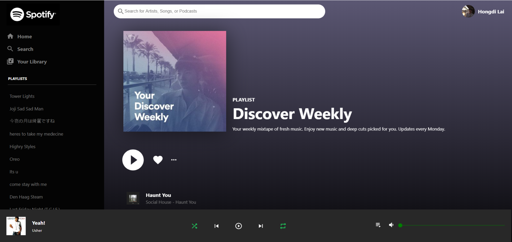

# Music Streaming Service App - Design of [Spotify-Clone](https://spotify-clone-5603e.web.app/)
 This app has no copyrights reserved, I've done it simply because I like the web design and seek to recreate it :)

 

## General Highlights of the Spotify-Clone App:
    
   |    Highlights                      |                         Description                                                                               |
   |:----------------------------------:| ------------------------------------------------------------------------------------------------------------------|  
   | **Responsive Design:**             | The App is scalable with width and height change                                                                  |
   | **User Authentication:**           | User will be redirected to the actual Spotify Login-In Page and the verified token would be kept as a state for further data fetching   |
   | **Real Spotify User Playlists:**    | User Playlists would be recorded and rendered after the successful Login-In (Playlists shown only if the user is already a spotify subscriber)  |
   | **Monthly Recommand Playlists Retrieve:** | Monthly Music Recommand Playlist Retrieved with Spotify API and React Context API  |
   | **Subtle Component Hover Effect:** | All components have subtle and clean hover effects which help optimise the user experience|
      
 

## Languages and Tools:

   |    Syntax   |                         Description                                       |
   | :---------: | :-----------------------------------------------------------------------: |  
   | Framework   | React.js with Hooks/Function Component/Context API (State Management)     |
   | Languages   | Javascript/CSS in BEM[[4]](#fn_4) /HTML        |
   | Code Editor | Visual Studio Code                                                        |
   | Hosting     | Firebase Hosting Service                                                  |
   | Database    | Cloud Firestore by Google                                                 |
   | API    | Spotify Developer API                                                 |

- *All code for this project could be found in the 'src' folder.*

 

## External Plugins 
 

## Components
 

## My Other Open Source Projects
 

## Footnodes

<b id="fn_1">[1]</b> - [↩](#footnode_1)  
<b id="fn_2">[2]</b> - [↩](#footnode_2)  
<b id="fn_3">[3]</b> - [↩](#footnode_3)  
<b id="fn_4">[4]</b> BEM refers to the Block, Element, Modifier methodology which allows code to be scalable and reusable. [↩](#footnode_4)  

